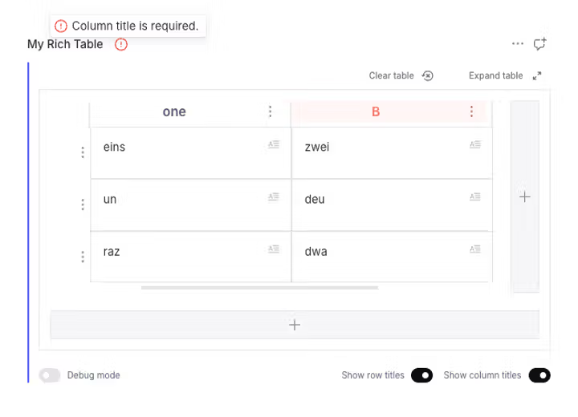
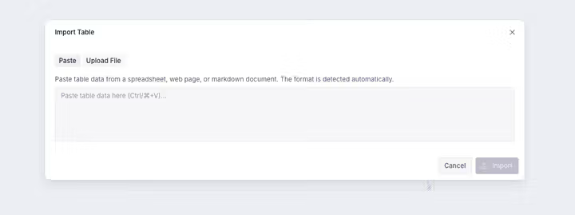
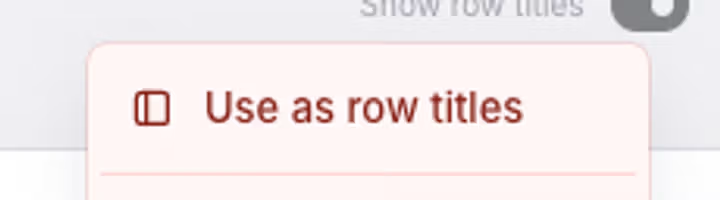
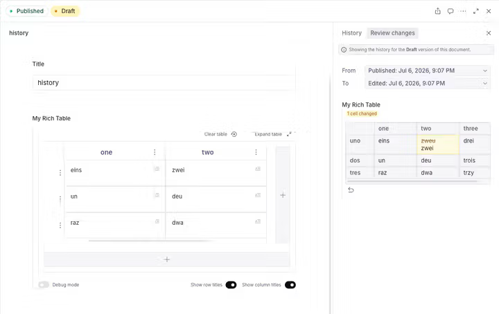

# Rich table plugin for Sanity

The last rich table plugin for Sanity you will need!


## Features

Production-ready, fully typed, and actively maintained. Curious what might come next? Take a look at the [roadmap](README.md#roadmap).

- **Fully customizable cell content** — bring your own Portable Text schema (styles, decorators, annotations, block objects, inline objects) with in-cell render components (see [Customizing cell content](README.md#customizing-cell-content))
- **Full Portable Text editing in every cell, out of the box** — a slash-command picker (`/`), Markdown shortcuts, a floating toolbar, link editing and an emoji picker. Whatever your cell schema declares — styles, decorators, lists, annotations — is instantly usable across all of them, with no extra wiring. Thanks to the amazing work of Christian Groengaard!
- **Import tables** from CSV, TSV, Excel (`.xlsx`), HTML or Markdown — via the field-actions menu, an inline button, or by pasting into the import dialog (see [Importing tables](README.md#importing-tables))
- **Paste tables straight into Portable Text** — a spreadsheet / HTML / Markdown table pasted into a document body becomes a `richTableBlock` (surrounding prose is kept). Opt in by adding the exported `RichTablePastePlugin` to your Studio config at the Portable Text editor level (see [Paste-to-import](README.md#paste-to-import-opt-in))
- **Per-table validation** (min rows / columns, required row / column titles) that surfaces inline on the offending cell, header or field marker (see [Validation](README.md#validation))
- **Readable diffs** in the Studio "Review changes" pane — a per-cell before→after view with inline highlights, plus inline changes right in the cells when Studio's inline-changes mode is on (see [Reviewing changes](README.md#reviewing-changes))
- **Promote a row or column to headers** — turn the first row into column titles, or the first column into row titles, straight from the context menu (see [Promote a row or column to headers](README.md#promote-a-row-or-column-to-headers))
- Rich table schema type `richTable` with Portable Text based cells
- Portable Text block type `richTableBlock`
- Initialise a table with intuitive table selection by click or drag
- Expandable table dialog
- Advanced row and column menus (move, delete, add new inline)
- Optional row and column titles
- Option to show table headers
- Unset table data with a button & confirmation dialog
- Dark and light mode support 😎
- 100% Typescript

|  |
| ------------------------------------------------------------------------------------------------------------------------------------------------------------ |
| Slash command picker on top of the toolbar                                                                                                                   |

|  |  |
| -------------------------------------------------------------------------------------------------------------------------------------------------------------- | -------------------------------------------------------------------------------------------------------------------------------------------------------------- |
| Column context menu                                                                                                                                            | Row context menu                                                                                                                                               |

## Compatibility

The plugin ships two lines. **2.x** targets Sanity 6 and is the `latest` release; **1.x** stays on Sanity 5 as a maintenance line.

| Plugin version | Sanity                   | React | Node    |
| -------------- | ------------------------ | ----- | ------- |
| **≥ 2.0.0**    | **6.x**                  | 19    | ≥ 22.12 |
| 1.1.x          | 5.x (≥ 5.11.0)           | 19    | ≥ 18    |
| 1.0.5          | 3.x / 4.x / 5.x (< 5.13) | 18–19 | ≥ 18    |

> **Why the split?** Sanity 6 bundles `@portabletext/editor` v7 / `@portabletext/toolbar` v8 and requires **Node ≥ 22.12**. Because the plugin's Portable Text editor/toolbar are version-coupled to the Studio's, a Sanity major means a plugin major. Pin the line that matches your Studio:
>
> ```sh
> # Sanity 6
> npm install sanity-plugin-rich-table       # latest (≥ 2.0.0)
> # Sanity 5
> npm install sanity-plugin-rich-table@^1.1
> # Sanity 3 / 4 (React 18)
> npm install sanity-plugin-rich-table@1.0.5
> ```

> [!NOTE]
> **React Compiler runtime (2.1.0+).** The plugin's build runs the React Compiler and ships output that imports React 19's built-in `react/compiler-runtime`. Make sure your Studio resolves a **single** React 19 — a duplicated React (or a mismatched `react-compiler-runtime` polyfill dragged in transitively, e.g. by another package) can surface a `useMemoCache … size N` error at runtime. Dedupe React via your package manager (e.g. pnpm `overrides`) if you hit it.

> [!IMPORTANT]
> **`sanity dev` only: table cells show `[type: _key]` placeholders when the table is nested in a Portable Text field.** If you use the table [as a custom block](#usage-as-custom-block-in-portable-text) (a `@portabletext/editor` cell editor nested inside your document-body `@portabletext/editor`), you may see the cells' custom block/inline objects render as raw `[imageWithCaption: …]` placeholders in **`sanity dev`**, with `useMemoCache "size 1 vs 20"` console spam — while `sanity build`/production renders them correctly.
>
> **Cause:** `@sanity/ui`'s React-Compiler output imports the standalone `react-compiler-runtime` shim, whose **dev** build installs a `LazyGuardDispatcher` that swaps React's *global* current dispatcher around every compiled function. That global swap corrupts the **inner** (cell) editor's hook state, so its custom components never mount. React 19 already ships a guard-free `react/compiler-runtime`, and `sanity build` uses the guard-free production runtime — so this is dev-only.
>
> **Fix:** alias the shim to React's built-in runtime in your `sanity.cli.ts` so dev matches prod:
>
> ```ts
> // sanity.cli.ts
> export default defineCliConfig({
>   // …
>   reactCompiler: {target: '19'},
>   vite: {
>     resolve: {
>       alias: [{find: /^react-compiler-runtime$/, replacement: 'react/compiler-runtime'}],
>     },
>     // keep Vite's optimizer from pre-bundling (and baking in) the shim before the alias applies
>     optimizeDeps: {exclude: ['react-compiler-runtime']},
>   },
> })
> ```
>
> To help you spot this, when your schema nests a rich table in a Portable Text field the plugin prints a one-time `console.error` hint in `sanity dev` if the `useMemoCache` warning fires. It's dev-only and points at this fix; disable it with `richTablePlugin({devConsoleHint: false})`.

## Migrating from 1.x

**2.0.0 is a platform bump.** It targets **Sanity 6** (React 19, Node ≥ 22.12). If you're still on Sanity 5, stay on the `^1.1` line (see [Compatibility](README.md#compatibility)). Otherwise bump Sanity, React and Node together, then install `sanity-plugin-rich-table@^2`.

That's the only breaking change: the public schema types (`richTable`, `richTableBlock`) and the exported TypeScript types are unchanged, so your schemas and stored content keep working as-is. Cell content is configured by pointing the plugin at a Portable Text array type in your own schema via `portableTextSchemaTypeName` (omit it for the built-in default) — see [Customizing cell content](README.md#customizing-cell-content).

## Installation

```sh
npm install sanity-plugin-rich-table
# or
pnpm add sanity-plugin-rich-table
# or
yarn add sanity-plugin-rich-table
```

## Usage

Add it as a plugin in `sanity.config.ts` (or .js):

```ts
import {defineConfig} from 'sanity'
import {richTablePlugin} from 'sanity-plugin-rich-table'

export default defineConfig({
  //...
  plugins: [
    richTablePlugin({
      // Optional. Name of a Portable Text array type in your schema, used for the
      // content of every table cell. Omit it and cells use the built-in default
      // (bold, italic, headings, lists, links, …). See "Customizing cell content".
      portableTextSchemaTypeName: 'tableCellContent',
    }),
  ],
})
```

After installing the plugin, you can use the `richTable` object type in your schemas — as a field, as a member of an array (many tables in one field), or nested inside your own object types — and the `richTableBlock` type in your Portable Text fields.

### Usage as field

```ts
defineField({
  name: 'myRichTable',
  title: 'My Rich Table',
  type: 'richTable', // Use the rich table object type
})
```

### Usage as an array item / object

`richTable` is a plain object type, so it works anywhere `defineField` / `defineArrayMember` accepts a type — including as a member of an array (a field that holds many tables) or nested inside one of your own object types.

```ts
defineField({
  name: 'tables',
  title: 'Tables',
  type: 'array',
  of: [
    defineArrayMember({
      type: 'richTable', // one rich table per array item
    }),
  ],
})
```

Give the member its own `name` when you want to mix rich tables with other types in the same array, or to attach per-instance [validation](README.md#validation). Array items have no field-actions menu, so the **Import table** action shows up as an inline button on each table instead (see [Importing tables](README.md#importing-tables)).

### Usage as custom block in Portable Text

```ts
// in the portable text schema
defineArrayMember({
  name: 'richTableBlock',
  title: 'Rich Table Block',
  type: 'richTableBlock', // Use the rich table block type
})
```

## Customizing cell content

Every cell is a Portable Text editor. By default it offers the standard marks (bold, italic, headings, lists, links). To control exactly what editors can do in a cell — your own styles, decorators, annotations, block objects and inline objects — define a Portable Text **array type** in your schema and pass its name as `portableTextSchemaTypeName` (omit it and cells use the default).

```ts
// schemas/tableCellContent.ts — a normal Portable Text array
import {defineArrayMember, defineType} from 'sanity'

export const tableCellContent = defineType({
  name: 'tableCellContent',
  type: 'array',
  of: [
    defineArrayMember({
      type: 'block',
      styles: [
        {title: 'Normal', value: 'normal'},
        {title: 'Heading', value: 'h2'},
      ],
      lists: [{title: 'Bullet', value: 'bullet'}],
      marks: {
        decorators: [
          {title: 'Strong', value: 'strong'},
          {title: 'Emphasis', value: 'em'},
        ],
        annotations: [{name: 'link', type: 'object', fields: [{name: 'href', type: 'url'}]}],
      },
    }),
  ],
})
```

Register `tableCellContent` in your schema `types`, then point the plugin at it:

```ts
plugins: [richTablePlugin({portableTextSchemaTypeName: 'tableCellContent'})]
```

The cell toolbar, slash-command picker and markdown shortcuts all follow this schema.

### Custom render components

To render your own marks and objects **inside the cells**, attach a component. Styles and decorators use Sanity's native `component` field; annotations, block objects and inline objects use a **table-specific sibling slot**:

| What          | Slot                          | Component props        |
| ------------- | ----------------------------- | ---------------------- |
| Style         | `component` (native)          | `BlockStyleProps`      |
| Decorator     | `component` (native)          | `BlockDecoratorProps`  |
| Annotation    | `components.tableAnnotation`  | `BlockAnnotationProps` |
| Block object  | `components.tableBlock`       | `BlockProps`           |
| Inline object | `components.tableInlineBlock` | `BlockProps`           |

The `table*` slots are siblings of Sanity's native `annotation` / `block` / `inlineBlock`: the plugin renders them in the cell, while the native slot is left for Sanity's default rendering so the built-in edit form (opened from the cell's edit button) keeps working. If you don't supply a component, cells fall back to a sensible default (image / reference preview, a titled chip for inline objects, and so on).

```ts
// a footnote annotation with a custom in-cell renderer
{
  name: 'footnote',
  type: 'object',
  fields: [{name: 'text', type: 'string'}],
  components: {tableAnnotation: FootnoteAnnotation},
}
```

See **[Using a custom Portable Text schema](./docs/README.md#using-a-custom-portable-text-schema)** for copy-paste minimal and advanced examples covering every slot.

## Validation

Add validation **per instance** — on the field, array member or Portable Text block — with the chainable `richTableRules()` builder. It reads like a native rule chain and drops straight into `validation` (no `(Rule) =>` wrapper needed):

```ts
import {defineField} from 'sanity'
import {richTableRules} from 'sanity-plugin-rich-table'

defineField({
  name: 'myRichTable',
  title: 'My Rich Table',
  type: 'richTable',
  validation: richTableRules().minRows(2).requireColumnTitles(),
})
```

Because it's applied per instance, each table can have its own rules:

```ts
// array member
defineArrayMember({
  name: 'richTableItem',
  type: 'richTable',
  validation: richTableRules().minColumns(3),
})

// Portable Text block
defineArrayMember({
  name: 'richTableBlock',
  type: 'richTableBlock',
  validation: richTableRules().requireRowTitles().requireColumnTitles(),
})
```

### Available rules

| Rule                     | Description                                                                        |
| ------------------------ | ---------------------------------------------------------------------------------- |
| `.minRows(count)`        | The table must have at least `count` rows.                                         |
| `.minColumns(count)`     | The table must have at least `count` columns.                                      |
| `.requireRowTitles()`    | Every row must have a title. Only enforced while **row titles** are enabled.       |
| `.requireColumnTitles()` | Every column must have a title. Only enforced while **column titles** are enabled. |

The title rules respect the table's row/column title toggles — a table with column titles turned off is never flagged for missing them.

### How errors show up

|  |
| ----------------------------------------------------------------------------------------------------------------------------------------------- |
| A missing column title is toned red on the offending header and rolls up into the field marker.                                                 |

Each violated rule reports a marker on the exact offending path, so the plugin surfaces it in place:

- **A specific row / column title** → that row / column header is toned (red for errors, amber for warnings).
- **Too few rows / columns** → the field/block header validation marker (identical to any native field), plus a banner in the empty-table state.
- **Cell content** (from your own PT / annotation validation) → the cell is toned and an invalid annotation (e.g. a bad link URL) renders in red.

All of the above also roll up into the standard field-title / block validation marker, exactly like a native field.

### Composing with native rules

`richTableRules()` is a normal `ValidationBuilder`, so combine it with built-in rules using the array form:

```ts
validation: [richTableRules().minRows(1), (Rule) => Rule.required()]
```

For custom logic, the lower-level `richTableValidator(config)` returns a `CustomValidator` you can drop into your own `Rule.custom`:

```ts
import {richTableValidator} from 'sanity-plugin-rich-table'

validation: (Rule) =>
  Rule.custom((table, context) => {
    const builtIn = richTableValidator({minRows: 2})(table, context)
    if (builtIn !== true) return builtIn
    // ...your own checks
    return true
  })
```

## Importing tables

Instead of building a table cell by cell, editors can import existing tabular data. Everything here works with the default `richTablePlugin({})` — there is nothing extra to configure.

|  |
| ----------------------------------------------------------------------------------------------------------------- |
| The **Import Table** dialog — paste or upload a file; the format is detected automatically.                       |

**Supported formats:** CSV, TSV, HTML and Markdown, plus Excel (`.xls` / `.xlsx`). Pasting auto-detects HTML, Markdown and TSV (CSV can be parsed on request); file upload accepts `.csv`, `.tsv`, `.xls`, `.xlsx`. The dialog shows a live preview and lets you mark the first row / first column as headers. Imports are capped at 300 rows.

### Where import appears

- **On a `richTable` field** — an **Import table** entry in the field-actions menu (the `⋮` next to the field label).
- **On a rich table used as an array item or a `richTableBlock`** — an inline **Import table** button (array items and Portable Text blocks have no field-actions menu).

### Paste-to-import (opt-in)

To turn tables **pasted into a Portable Text field** into rich-table blocks — including a table copied alongside prose from a web page or document (the prose is kept, each table becomes a `richTableBlock`) — add the exported `RichTablePastePlugin` to your Portable Text input:

```tsx
// sanity.config.ts
import {defineConfig} from 'sanity'
import type {PortableTextPluginsProps} from 'sanity'
import {richTablePlugin, RichTablePastePlugin} from 'sanity-plugin-rich-table'

function PortableTextPlugins(props: PortableTextPluginsProps) {
  return (
    <>
      {props.renderDefault(props)}
      <RichTablePastePlugin />
    </>
  )
}

export default defineConfig({
  // ...
  plugins: [richTablePlugin({})],
  form: {components: {portableText: {plugins: PortableTextPlugins}}},
})
```

This affects only Sanity's document-body Portable Text inputs — not the rich table's own cell editors.

A pasted table is inserted with the `_type` of **your** rich-table block member, detected automatically from the field's schema — so if you registered it under a different name (e.g. `defineArrayMember({name: 'richTable', type: 'richTableBlock'})` to keep the stored `_type` stable), pasted blocks still match your member. No configuration needed.

### Excel (`.xlsx`) support

Excel parsing uses [SheetJS](https://sheetjs.com) (`xlsx`), declared as an **optional dependency** (installed by default). If you install without optional dependencies, CSV / TSV / HTML / Markdown import still work and Excel upload simply reports that it is unavailable.

### Building your own import UI

The parsers and converter are exported, so you can drive imports programmatically or build a custom dialog:

```ts
import {
  toRichTableValue, // ParsedTable -> the richTable value shape
  parseFile, // File -> ParsedTable (by extension)
  detectFormat, // sniff clipboard html/plain -> format
  parseCsvTable,
  parseTsvTable,
  parseXlsxTable,
  parseHtmlTable,
  parseMarkdownTable,
  TableImportDialog, // the built-in paste/upload dialog component
  RichTablePastePlugin,
  createTablePasteBehaviors,
} from 'sanity-plugin-rich-table'
```

## Promote a row or column to headers

Already typed a header row or column into the table body? You can turn it into real titles in one step from the row / column context menu — no retyping.

|  |
| -------------------------------------------------------------------------------------------------------------------- |
| Promote the first column to row titles straight from its context menu.                                               |

- **First row → column titles:** open the first row's **⋮** menu and choose **"Use as column titles"**. Each cell in row 1 becomes the title of the column above it, then row 1 is removed.
- **First column → row titles:** open the first column's menu and choose **"Use as row titles"**. Each cell in column A becomes its row's title, then column A is removed.

The action:

- Only appears on the **first** row / column, and is disabled when it would empty the table (a table needs at least one row and column).
- Runs behind a **confirmation dialog**, because it is **lossy** — cell content is rich Portable Text while titles are plain strings, so formatting is flattened to plain text — and it removes a row / column. It applies as a single step you can undo, or revert from the **Review changes** panel.
- Switches on the matching titles (**Show row titles** / **Show column titles**) so the promoted headers are visible.

The confirmation is registered in the pane's URL params (like the expanded editor), so it is deep-linkable, survives a refresh, and the browser back button closes it.

> Tip: importing a table lets you mark the first row / column as headers up front — see [Importing tables](README.md#importing-tables). Use this promote action when a table is already in place.

## Render tables

Read more about rendering rich tables in your frontend application in the [Render tables](./docs/README.md#render-tables) guide.
In the docs you will find even more details about the [data structure](./docs/README.md#data-structure) used by this plugin.
And get a suggestion on how to [merge cells when rendering](./docs/README.md#merging-cells).

Need Markdown instead of the DOM? The exported `toMarkdownTable(tableData)` serializes any table value to a GitHub-flavored Markdown table (the inverse of the importer) — see [Export to Markdown](./docs/README.md#export-to-markdown).

```ts
import {toMarkdownTable} from 'sanity-plugin-rich-table'

const markdown = toMarkdownTable(tableData)
```

## Reviewing changes

Rich tables get a custom diff in the Studio's **Review changes** pane (used by document history and content releases), instead of the generic field-by-field differ that struggles with the nested rows → cells → Portable Text structure:

|  |
| ------------------------------------------------------------------------------------------------------------------------------------------------------- |
| The **Review changes** pane shows a per-cell before→after diff for the whole table.                                                                     |

- A grid summarising added / removed / moved rows and columns and which cells changed.
- Click a changed cell for a combined **before → after** view: removed text is struck through and added text is highlighted inline, rather than two separate snapshots.
- When Studio's inline-changes mode is on (the toggle that adds `?displayInlineChanges=true` to the URL), the same highlights appear directly in the cells while they stay fully editable.

See [Reviewing changes](./docs/README.md#reviewing-changes) in the docs for details.

## Roadmap

The plugin is complete and production-ready today — nothing below is required for day-to-day use. These are enhancements under consideration for future releases:

- Improved performance for very large tables
- Further accessibility refinements
- A built-in option to merge cells in the table input

## TypeScript Support

This plugin is written in TypeScript and exports types for consumers:

```ts
import type {
  RichTableType,
  RichTableRowType,
  RichTableCellType,
  RichTableValidationConfig, // shape accepted by the validation helpers
  RichTableRuleBuilder, // return type of richTableRules()
} from 'sanity-plugin-rich-table'
```

See the [data structure documentation](./docs/data-structure.md) for detailed type information, and [Validation](README.md#validation) for `richTableRules()` / `richTableValidator()`.

## Upgrade notes

### Row schema type renamed `richTableRow` → `row` (SYS-141)

The patch release that fixes `sanity graphql deploy` renames the **registered schema type** for table rows from `richTableRow` to `row`. Previously the type was registered as `richTableRow` but its array member wrote rows to content as `_type: 'row'` — that mismatch made `sanity graphql deploy` fail with an _"anonymous inline object"_ error. Registering the type under the name that content already uses fixes deploy.

**For virtually all projects this is a no-op — nothing breaks:**

- ✅ **Existing content is unaffected.** Rows have always been stored as `_type: 'row'`, which is exactly what the renamed type now registers. No content migration is required.
- ✅ The exported TypeScript type **`RichTableRowType` is unchanged**.
- ✅ The public schema types you reference — **`richTable`** and **`richTableBlock`** — are unchanged.

**Take action only if:**

- You referenced the internal `richTableRow` **schema type name** directly in your own schema (e.g. `type: 'richTableRow'`). Change it to `type: 'row'`.
- You have hand-authored or imported content that stored rows as `_type: 'richTableRow'` (not produced by this plugin). Rewrite those items to `_type: 'row'` with the script at [`docs/migrations/rename-richtablerow-to-row.sh`](./docs/migrations/rename-richtablerow-to-row.sh). Because `_type` is an **immutable** attribute, this can't be a `sanity migration run` script (`at('_type', set(...))` fails with _"Cannot modify immutable attribute"_); the script uses Sanity's sanctioned workaround — export the dataset, rewrite the type in the NDJSON, and re-import with `--replace` (see [Migrating your schema and content](https://www.sanity.io/docs/content-lake/schema-and-content-migrations)).

## License

[MIT](LICENSE) © Saskia Bobinska

## Develop & test

This plugin uses [@sanity/plugin-kit](https://github.com/sanity-io/plugin-kit)
with default configuration for build & watch scripts.

See [Testing a plugin in Sanity Studio](https://github.com/sanity-io/plugin-kit#testing-a-plugin-in-sanity-studio)
on how to run this plugin with hotreload in the studio.

### Package manager

The repo pins its pnpm version through the `packageManager` field in `package.json`,
so local development and CI run the exact same pnpm. Enable [Corepack](https://nodejs.org/api/corepack.html)
once and your `pnpm` will match automatically:

```sh
corepack enable
```

> Node ships Corepack; if `pnpm` doesn't pick up the pinned version, run `corepack prepare --activate`.
> Bump the version in the `packageManager` field to upgrade — nothing else needs changing.

### Running tests

```sh
pnpm test          # Run tests once
pnpm test:watch    # Run tests in watch mode
pnpm test:coverage # Run tests with coverage report
```

### Release new version

Run the "CI & Release" workflow from GitHub Actions.
Make sure to select the main branch and check "Release new version".

Semantic release will only release on configured branches, so it is safe to run release on any branch.
