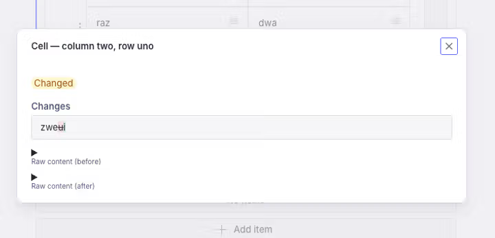

# Rich table plugin documentation

## Table of contents

1. [Overview](#overview)
2. [Installation](#installation)
3. [Usage in Sanity Studio](#usage-in-sanity-studio)
4. [Using a custom Portable Text schema](#using-a-custom-portable-text-schema)
5. [Data Structure](#data-structure)
6. [Debugging data issues](#debugging-data-issues)
7. [Reviewing changes](#reviewing-changes)
8. [Render tables](#render-tables)
9. [Export to Markdown](#export-to-markdown)
10. [Merging cells](#merging-cells)

## Overview

This documentation provides an overview of the rich table plugin for Sanity Studio, including installation instructions, usage guidelines, and details on the data structure and rendering of tables.

## Installation

To install the rich table plugin, run the following command in your Sanity Studio project directory:

```sh
npm install sanity-plugin-rich-table
```

## Usage in Sanity Studio

Add it as a plugin in `sanity.config.ts` (or .js):

```ts
import {defineConfig} from 'sanity'
import {richTablePlugin} from 'sanity-plugin-rich-table'

export default defineConfig({
  //...
  plugins: [
    richTablePlugin({
      // Optional. Name of a Portable Text array type used for cell content.
      // If omitted, cells use the built-in default (bold, italic, headings,
      // lists, links, …). See "Using a custom Portable Text schema" below.
      portableTextSchemaTypeName: 'tableCellContent',
    }),
  ],
})
```

After installing the plugin, you can use the `richTable` object type in your schemas — as a field, as a member of an array (many tables in one field), or nested inside your own object types — and the `richTableBlock` type in your Portable Text fields.

### Usage as a field

```ts
defineField({
  name: 'myRichTable',
  title: 'My Rich Table',
  type: 'richTable', // Use the rich table object type
})
```

### Usage as an array item / object

`richTable` is a plain object type, so it works anywhere `defineField` / `defineArrayMember` accepts a type — including as a member of an array (a field that holds many tables) or nested inside one of your own object types.

```ts
defineField({
  name: 'tables',
  title: 'Tables',
  type: 'array',
  of: [
    defineArrayMember({
      type: 'richTable', // one rich table per array item
    }),
  ],
})
```

When a table is used as an array item, it stores a root `_type` and `_key` on the value (see [Data Structure](#data-structure)), and — because array items have no field-actions menu — the **Import table** action appears as an inline button on each table.

### Usage as a custom block in Portable Text

To use the rich table as a block in the Portable Text (block content) editor, you only need to add in the schema's `of`:

```ts
// schemas/<your-portable-text-schema-name>.ts
defineArrayMember({
  name: 'richTableBlock',
  title: 'Rich Table Block',
  type: 'richTableBlock', // Use the rich table block type
})
```

## Using a custom Portable Text schema

Every table cell is a Portable Text editor. Out of the box it offers the standard marks — bold, italic, headings, lists and links. To decide exactly what editors can do inside a cell, define your own Portable Text **array type**, register it, and pass its name to the plugin as `portableTextSchemaTypeName`. If you omit the option, cells fall back to the built-in default.

```ts
// sanity.config.ts
plugins: [richTablePlugin({portableTextSchemaTypeName: 'tableCellContent'})]
```

> [!WARNING]
> Do **not** add `richTableBlock` (or any block object of `type: 'richTable'`) to your cell-content schema. A table cell can't contain a table: it would nest the schema infinitely and crash Sanity's schema normalization with _"Maximum call stack size exceeded"_. The plugin guards against this — if the type you pass as `portableTextSchemaTypeName` includes a table, it throws a clear error at studio load naming the offending type.

Because it's a normal Portable Text array, everything you already know about `styles`, `lists`, `marks.decorators`, `marks.annotations`, block objects and inline objects applies. The cell toolbar, the slash-command picker (`/`) and the markdown shortcuts all follow whatever this schema declares.

### Rendering your marks and objects in the cell

To render custom output **inside a cell**, attach a component. Styles and decorators use Sanity's native `component` field. Annotations, block objects and inline objects use a **table-specific sibling slot**:

| What          | Where you declare it          | Slot                          | Component props        |
| ------------- | ----------------------------- | ----------------------------- | ---------------------- |
| Style         | `styles[]`                    | `component` (native)          | `BlockStyleProps`      |
| Decorator     | `marks.decorators[]`          | `component` (native)          | `BlockDecoratorProps`  |
| Annotation    | `marks.annotations[]`         | `components.tableAnnotation`  | `BlockAnnotationProps` |
| Block object  | top-level array member        | `components.tableBlock`       | `BlockProps`           |
| Inline object | the block member's own `of[]` | `components.tableInlineBlock` | `BlockProps`           |

**Why the `table*` sibling slots?** The plugin renders each cell in its own editor, but the built-in **edit form** (the pencil in the cell's popover) is powered by Sanity's native Portable Text input behind the scenes. Sanity's native input renders annotations via `props.renderDefault` and needs its own default node to open the edit form — neither of which the cell editor provides. So the plugin reads your in-cell component from `tableBlock` / `tableInlineBlock` / `tableAnnotation`, leaving the native `block` / `inlineBlock` / `annotation` slots for Sanity's default rendering. That way your component shows in the cell **and** editing still works. Styles and decorators don't have this split — they use the native `component` field directly.

If you don't supply a component, cells fall back to a sensible default: image and reference blocks get a preview, other block objects get a titled card, inline objects get a titled chip, and annotations get an underlined span.

### Minimal starter

A cell schema with a curated set of standard marks — no custom components, just control over what's available. Copy this as a starting point:

```ts
// schemas/tableCellContent.ts
import {defineArrayMember, defineType} from 'sanity'

export const tableCellContent = defineType({
  name: 'tableCellContent',
  type: 'array',
  of: [
    defineArrayMember({
      type: 'block',
      styles: [
        {title: 'Normal', value: 'normal'},
        {title: 'Heading', value: 'h2'},
        {title: 'Quote', value: 'blockquote'},
      ],
      lists: [
        {title: 'Bullet', value: 'bullet'},
        {title: 'Numbered', value: 'number'},
      ],
      marks: {
        decorators: [
          {title: 'Strong', value: 'strong'},
          {title: 'Emphasis', value: 'em'},
          {title: 'Code', value: 'code'},
        ],
        annotations: [
          {name: 'link', type: 'object', fields: [{name: 'href', type: 'url', title: 'URL'}]},
        ],
      },
    }),
  ],
})
```

Add `tableCellContent` to your schema `types`, then set `portableTextSchemaTypeName: 'tableCellContent'` on the plugin.

### Advanced example

The same schema, now with a custom style, decorator, annotation, block object and inline object — each with its own in-cell renderer:

```tsx
// components/cell-components.tsx
import type {BlockAnnotationProps, BlockDecoratorProps, BlockProps, BlockStyleProps} from 'sanity'

// Style — wraps the block's text
export const LeadStyle = (props: BlockStyleProps) => (
  <p style={{fontSize: '1.1em', color: 'var(--card-muted-fg-color)'}}>{props.children}</p>
)

// Decorator — wraps the marked text
export const HighlightDecorator = (props: BlockDecoratorProps) => (
  <mark style={{backgroundColor: '#fde68a'}}>{props.children}</mark>
)

// Annotation — `children` is the annotated text
export const FootnoteAnnotation = (props: BlockAnnotationProps) => (
  <span style={{borderBottom: '1px dotted currentColor'}}>
    {props.children}
    <sup>*</sup>
  </span>
)

// Block object — `value` is the object; render your own preview
export const CalloutBlock = (props: BlockProps) => {
  const {text} = props.value as {text?: string}
  return (
    <aside style={{borderLeft: '3px solid var(--card-focus-ring-color)', paddingLeft: 8}}>
      {text}
    </aside>
  )
}

// Inline object — a void inline node; render from `value`
export const MentionInline = (props: BlockProps) => {
  const {label} = props.value as {label?: string}
  return <span style={{background: '#e6ebff', borderRadius: 3, padding: '0 0.25em'}}>@{label}</span>
}
```

```ts
// schemas/tableCellContent.ts
import {defineArrayMember, defineField, defineType} from 'sanity'
import {
  CalloutBlock,
  FootnoteAnnotation,
  HighlightDecorator,
  LeadStyle,
  MentionInline,
} from '../components/cell-components'

export const tableCellContent = defineType({
  name: 'tableCellContent',
  type: 'array',
  of: [
    defineArrayMember({
      type: 'block',
      styles: [
        {title: 'Normal', value: 'normal'},
        {title: 'Lead', value: 'lead', component: LeadStyle}, // custom style
      ],
      lists: [{title: 'Bullet', value: 'bullet'}],
      marks: {
        decorators: [
          {title: 'Strong', value: 'strong'},
          {title: 'Highlight', value: 'highlight', component: HighlightDecorator}, // custom decorator
        ],
        annotations: [
          {
            name: 'footnote',
            type: 'object',
            fields: [defineField({name: 'text', type: 'string'})],
            components: {tableAnnotation: FootnoteAnnotation}, // custom annotation renderer
          },
        ],
      },
      // inline objects are declared in the block member's own `of`
      of: [
        defineArrayMember({
          name: 'mention',
          type: 'object',
          fields: [defineField({name: 'label', type: 'string'})],
          components: {tableInlineBlock: MentionInline}, // custom inline renderer
        }),
      ],
    }),
    // block objects are top-level members of the array
    defineArrayMember({
      name: 'callout',
      type: 'object',
      fields: [defineField({name: 'text', type: 'text'})],
      components: {tableBlock: CalloutBlock}, // custom block renderer
    }),
  ],
})
```

Editing a block object, inline object or annotation opens Sanity's native edit form (the same fields you defined), so you never have to build an editing UI — only the in-cell presentation.

|  |
| -------------------------------------------------------------------------------------------------------------------------- |
| Editing an image in a cell opens Sanity's native image modal — no custom editing UI required.                              |

## Data Structure

The underlying data structure of the rich table is not an array directly, instead it's an object with a `rows` and a `columnHeaders` array as well as UI flags for hidding column and row titles.

Using an object instead of a simple array allows us to store column meta data separately and manage UI flags more easily. And it also circumvents the limitations that arrays cannot be nested directly in arrays in Sanity.

The main object shape is as follows:

```ts
interface RichTableType {
  rows: Array<RichTableRowType> // required, min.1
  columnHeaders?: Array<ColumnHeader & ObjectItem>
  hasColumnTitles?: boolean
  hasRowTitles?: boolean
}
interface RichTableRowType {
  title?: string
  cells?: Array<RichTableCellType>
}
interface RichTableCellType {
  content: Array<PortableTextBlock>
}
interface ColumnHeader {
  title?: string
  cellIndex: number // required
}
```

**Read more about the data structure in [data-structure.md](./data-structure.md)**

### Debugging data issues

Each instance of the rich table input has a debug button in the bottom-left corner. Clicking it will open the default underlying fields of the object, so you can inspect and edit the data in the form you are used to.

**_DO NOT REMOVE CELLS WITH EMPTY CONTENT FROM THE ARRAYS MANUALLY!_**

When cells are created each cell will automatically receive a `content` array with one child. This child (type `PortableTextTextBlock`) has an empty `text` node. Unfortunately this is needed for the UI to play nice.

## Reviewing changes

Rich tables render a custom diff in the Studio's **Review changes** pane (used by document history and content releases), because the generic field-by-field differ struggles with the deeply nested rows → cells → Portable Text structure.

What you get:

- **A diff grid** summarising which rows and columns were added, removed or moved, and which cells changed. Column/row title edits and title-visibility toggles are shown too.
- **A combined cell view.** Click a changed cell to open a detail dialog with a single **Changes** section: removed text is struck through, added text is highlighted, and unchanged text is left plain — instead of separate "Before" and "After" blocks. Each revision's raw Portable Text is still available under _Raw content_.

|  |
| ------------------------------------------------------------------------------------------------------------------------------------------- |
| Click into a cell in the diff to inspect its content change on its own.                                                                     |

- **Inline changes in the editor.** When Studio's inline-changes mode is enabled (the toggle that adds `?displayInlineChanges=true` to the URL), the same before→after highlights are overlaid directly on each cell's editor while it stays fully editable. This reads the compared revision from the Structure tool's document pane, so it applies when you are reviewing a revision there.

The diff compares the plain text of each cell (marks and annotations are ignored), so formatting-only changes may not be highlighted — open the cell dialog's _Raw content_ to inspect those. Nothing here needs configuration; the diff is wired up automatically for the `richTable` type.

## Render tables

To render the rich table data in your frontend application, you can use some of the following example React components.
Other frameworks as well as libraries (like Tanstack Table) will be able to use a similar approach since your table data is not pesky like Mardown or locked in HTML strings or iFrames.

> **Rendering a custom cell schema.** Cell content is plain Portable Text, so custom block objects, inline objects and annotations from a [custom Portable Text schema](#using-a-custom-portable-text-schema) are rendered on the frontend the usual way — pass matching renderers to `@portabletext/react`'s `components` prop (`types` for block/inline objects, `marks` for annotations and decorators). The Studio `tableBlock` / `tableInlineBlock` / `tableAnnotation` slots only affect the in-Studio cell editor; they don't ship to your frontend.

### Using a simple HTML table in React

```tsx
import React from 'react'
import {RichTableType} from 'sanity-plugin-rich-table'
import {PortableText} from '@portabletext/react'

interface RichTableProps {
  tableData: RichTableType
}

export const RichTable: React.FC<RichTableProps> = ({tableData}) => {
  const {rows, columnHeaders, hasColumnTitles, hasRowTitles} = tableData

  return (
    <table>
      <thead>
        {hasColumnTitles && (
          <tr>
            {hasRowTitles && <th></th>}
            {columnHeaders?.map((header, index) => (
              <th key={index}>{header.title}</th>
            ))}
          </tr>
        )}
      </thead>
      <tbody>
        {rows.map((row, rowIndex) => (
          <tr key={rowIndex}>
            {hasRowTitles && <th>{row.title}</th>}
            {row.cells?.map((cell, cellIndex) => (
              <td key={cellIndex}>
                <PortableText value={cell.content} components={/* your components */} />
              </td>
            ))}
          </tr>
        ))}
      </tbody>
    </table>
  )
}
```

### Using styled components for a grid layout

The grid layout can be a flexible alternative to traditional tables:

```tsx
import React from 'react'
import styled from 'styled-components'
import {RichTableType} from 'sanity-plugin-rich-table'
import {PortableText} from '@portabletext/react'
interface RichTableProps {
  tableData: RichTableType
}
const TableGrid = styled.div<{$columns: number}>`
  display: grid;
  grid-template-columns: repeat(${(props) => props.$columns}, 1fr);
  gap: 16px;
`

export const RichTableGrid: React.FC<RichTableProps> = ({tableData}) => {
  const {rows, columnHeaders, hasColumnTitles, hasRowTitles} = tableData
  const totalColumns = (hasRowTitles ? 1 : 0) + (columnHeaders?.length || 0)

  return (
    <TableGrid $columns={totalColumns}>
      {/* Placeholder for first cell in header row, so that column titles and row titles dont akwardly sit on top of each other */}
      {hasRowTitles && <div />}
      {hasColumnTitles &&
        columnHeaders?.map((header, index) => (
          <div key={header._key} style={{fontWeight: 'bold'}}>
            {header.title}
          </div>
        ))}
      {rows.map((row, rowIndex) => (
        <React.Fragment key={row._key}>
          {hasRowTitles && <div style={{fontWeight: 'bold'}}>{row.title}</div>}
          {row.cells?.map((cell, cellIndex) => (
            <div key={cell._key}>
              <PortableText value={cell.content} components={/* your components */} />
            </div>
          ))}
        </React.Fragment>
      ))}
    </TableGrid>
  )
}
```

Easy peasy!

### Using Astro

The same data works in an Astro component. The one difference from React is that cell content renders through [`astro-portabletext`](https://github.com/theisel/astro-portabletext) instead of `@portabletext/react`:

```tsx
---
import type {RichTableType} from 'sanity-plugin-rich-table'
import {PortableText} from 'astro-portabletext'

interface Props {
  tableData: RichTableType
}

const {rows, columnHeaders, hasColumnTitles, hasRowTitles} = Astro.props.tableData
---

<table>
  {hasColumnTitles && (
    <thead>
      <tr>
        {hasRowTitles && <th />}
        {columnHeaders?.map((header) => <th>{header.title}</th>)}
      </tr>
    </thead>
  )}
  <tbody>
    {rows.map((row) => (
      <tr>
        {hasRowTitles && <th scope="row">{row.title}</th>}
        {row.cells?.map((cell) => (
          <td><PortableText value={cell.content} /></td>
        ))}
      </tr>
    ))}
  </tbody>
</table>
```

When you wire this up as a `richTableBlock` component for a Portable Text field, the table object arrives on `Astro.props.node` rather than a prop.

> [!TIP]
> If your Studio and Astro site live in the same repo, import only the **type** (`import type`) from `sanity-plugin-rich-table` and render cells with `astro-portabletext`. Pulling the plugin's runtime or `@portabletext/react` into the front end drags a second copy of React into the bundle, which breaks Sanity Visual Editing.

## Export to Markdown

Rendering isn't only for the DOM. `toMarkdownTable` serializes a stored table value into a GitHub-flavored Markdown table string — the inverse of the plugin's Markdown [importer](../README.md#importing-tables). It's a pure, dependency-free function, so it runs equally well in the Studio, a build step or a server (a Node script, a webhook, an export endpoint, or piping table data to an LLM).

```ts
import {toMarkdownTable} from 'sanity-plugin-rich-table'

const markdown = toMarkdownTable(tableData)
// |  | First | Second |
// | --- | --- | --- |
// | **Row 1** | Cell 1-1 | Cell 1-2 |
// | **Row 2** | Cell 2-1 | Cell 2-2 |
```

What it does:

- **Column titles** (when `hasColumnTitles`) become the header row, ordered by each header's `cellIndex`. Without them a valid — but empty — header row is emitted, because a GitHub-flavored Markdown table always needs one.
- **Row titles** (when `hasRowTitles`) become a leading column, each wrapped in `**bold**` so a round-trip back through `parseMarkdownTable` re-detects them as titles.
- **Ragged rows** are padded to the widest row so every column lines up.
- **Cell content** is flattened to plain text by default (marks and annotations dropped, `|` escaped, newlines folded to `<br>`).

### Rendering rich cells to Markdown

By default cells become plain text. To emit inline Markdown for your own schema — bold, links, or a custom block object — pass a `cellToMarkdown` serializer. Whatever you return is written verbatim into the cell, so escape `|` and newlines yourself if your output can contain them.

```ts
import {toMarkdownTable} from 'sanity-plugin-rich-table'
import {toPlainText} from '@portabletext/toolkit'
// or bring your own PT → Markdown converter, e.g. a @portabletext/react-to-markdown pass

const markdown = toMarkdownTable(tableData, {
  cellToMarkdown: (cell) =>
    toPlainText(cell.content).replace(/\|/g, '\\|').replace(/\r?\n/g, '<br>'),
})
```

## Merging cells

If you leave some cells empty, you can achieve a simple cell merging effect in your table renderings by using CSS. For example, you can use the `grid-column` property in a CSS grid layout or the `colspan` attribute in an HTML table to span multiple columns.

you can check if a cell is empty by checking if the `content` array is empty for the first item in the `chilren` array and specifically the `text`. unfortunately, there is no built-in way to merge cells in the Sanity Studio editor itself at the moment.

```tsx
// first check which cells are empty and then add a flag to the previous / next cell to span accordingly
const mergedTableData = tableData.rows.map((row) => {
  const newCells = []
  let skipNext = 0

  for (let i = 0; i < row.cells.length; i++) {
    if (skipNext > 0) {
      skipNext--
      continue
    }

    const cell = row.cells[i]
    let colSpan = 1

    // Check for empty cells to the right
    for (let j = i + 1; j < row.cells.length; j++) {
      const nextCell = row.cells[j]
      if (isCellEmpty(nextCell)) {
        colSpan++
      } else {
        break
      }
    }

    newCells.push({...cell, colSpan})
    skipNext = colSpan - 1
  }

  return {...row, cells: newCells}
})
function isCellEmpty(cell) {
  return (
    !cell.content ||
    cell.content.length === 0 ||
    (cell.content[0]._type === 'block' &&
      cell.content[0].children.every((child) => child._type === 'span' && child.text.trim() === ''))
  )
}
// Then use the colSpan property in your rendering logic
;<TableGrid $columns={totalColumns}>
  {/* ... header row etc. */}
  {mergedTableData.rows.map((row, rowIndex) => (
    <React.Fragment key={row._key}>
      {hasRowTitles && <div style={{fontWeight: 'bold'}}>{row.title}</div>}
      {row.cells?.map((cell, cellIndex) => (
        <div key={cell._key} style={{gridColumn: `span ${cell.colSpan || 1}`}}>
          <PortableText value={cell.content} components={/* your components */} />
        </div>
      ))}
    </React.Fragment>
  ))}
</TableGrid>
```

With a bit of logic and CSS, you can create merged cells in your rich table renderings! 🥳
